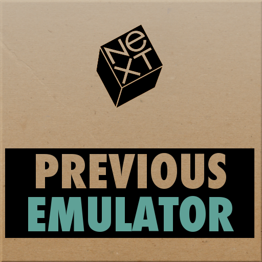

Previous 1.4i+

[http://previous.alternative-system.com/](http://previous.alternative-system.com/)

Contents:
---------
1. License
2. About Previous
3. Compiling and installing
4. Known problems
5. Running Previous
6. Contributors
7. Contact

# License
 ----------

This program is free software; you can redistribute it and/or modify it under
the terms of the GNU General Public License as published by the Free Soft-
ware Foundation; either version 2 of the License, or (at your option) any
later version.

This program is distributed in the hope that it will be useful, but WITHOUT ANY
WARRANTY; without even the implied warranty of MERCHANTABILITY or FITNESS
FOR A PARTICULAR PURPOSE. See the GNU General Public License for more details.

You should have received a copy of the GNU General Public License along with
this program; if not, write to the
 Free Software Foundation, Inc.,
 51 Franklin Street, Fifth Floor, Boston,
 MA  02110-1301, USA

# About Previous
 -----------------

Previous is a NeXT Computer emulator based on the Atari emulator Previous. It uses 
the latest m68k emulation core from WinUAE and the i860 emulator from Jason Eckhardt. 
Previous is confirmed to compile and run on Linux, Mac OS X and Windows. It may also 
work on other Systems which are supported by the SDL library, like FreeBSD, NetBSD 
and BeOS.

Previous emulates the following machines:

- NeXT Computer (original 68030 Cube)

- NeXTcube

- NeXTcube Turbo

- NeXTstation

- NeXTstation Turbo

- NeXTstation Color

- NeXTstation Turbo Color

- NeXTdimension Graphics Board

# Compiling and installing
 ---------------------------

For using Previous, you need to have installed the following libraries:

Required:
- The SDL library v2.0.4 or later (http://www.libsdl.org)
- The zlib compression library (http://www.gzip.org/zlib/)

Don't forget to also install the header files of these libraries for compiling
Previous (some Linux distributions use separate development packages for these
header files)!

For compiling Previous, you need a C compiler (preferably GNU C), and a working
CMake installation (see http://www.cmake.org/ for details).

CMake can generate makefiles for various flavors of "Make" (like GNU-Make)
and various IDEs like Xcode on Mac OS X. To run CMake, you've got to pass the
path to the sources of Previous as parameter, for example run the following if
you are in the topmost directory of the Previous source tree:

	cmake .

If you're tracking Previous version control, it's preferable to do
the build in a separate build directory as above would overwrite
the (non-CMake) Makefiles coming with Previous:

	mkdir -p build
	cd build
	cmake ..

Have a look at the manual of CMake for other options. Alternatively, you can
use the "cmake-gui" program to configure the sources with a graphical
application.

After cmake finished the configuration successfully, you can compile Previous
by typing "make". If all works fine, you'll get the executable "Previous" in 
the src/ subdirectory of the build tree.

# Status
 ---------

Previous is still work in progress. Some hardware is not yet emulated:

CPU		good (but not cycle-exact)

MMU		good

FPU		good

DSP		good

DMA		good

NextBus		good

Memory		good

2-bit graphics	good

Color graphics	good

RTC		good

Timers		good

SCSI drive	good

MO drive	good (single drive)

Floppy drive	good

Ethernet	good

Serial		dummy

Printer		good

Sound		partial (no microphone)

Keyboard	good

Mouse		good

ADB		dummy

Nitro		dummy

Dimension	partial (no video I/O)

There are remaining problems with the host to emulated machine interface for
input devices.

 # Known issues
 ---------------

- Un-emulated hardware may cause problems in certain situations (see above).

- The MO drive causes problems (mainly hangs) when both drives are used (disabled).

- Variable CPU speed mode does not work if an MO drive is connected.

- DSP sound has timing related issues. DSPmusic under NeXTstep 0.9 sometimes produces bad audio or hangs in variable speed mode.

- ScorePlayer under NeXTstep 2.x produces distorted sound in normal CPU mode.

- Shortcuts do not work properly or overlap with host commands on some platforms.

- CPU timings are not correct. You may experience performance differences compared to real hardware.

- There is some instability when running Mac OS via Daydream.

- FPU only works on x86 hosts.

- Slirp: In certain rare conditions Slirp may crash.

# Release notes
 ----------------

  Previous v1.0:
  > Initial release.

  Previous v1.1:
  > Adds Turbo chipset emulation.
  > Improves DSP interrupt handling.
  > Improves hardclock timing.

  Previous v1.2:
  > Adds support for running Mac OS via Daydream.
  > Improves mouse movement handling.
  > Adds dummy Nitro emulation.
  > Improves dummy SCC emulation.

  Previous v1.3:
  > Adds Laser Printer emulation.
  > Introduces option for swapping cmd and alt key.

  Previous v1.4:
  > Adds NeXTdimension emulation, including emulated i860 CPU.
  > Improves timings and adds a mode for higher than real speed.
  > Improves emulator efficiency through optimizations and threads.
  > Improves mouse movement handling.
  > Improves Real Time Clock. Time is now handled correctly.

# Running Previous
 -------------------

For running the emulator, you need an image of the boot ROM of the emulated 
machine.

While the emulator is running, you can open the configuration menu by
pressing F12, toggle between fullscreen and windowed mode by pressing F11 
and initiate a clean shut down by pressing F10 (emulates the power button).

# Contributors
 ---------------

Many thanks go to the members of the NeXT International Forums for their
help. Special thanks go to Gavin Thomas Nicol, Piotr Twarecki, Toni Wilen,
Michael Bosshard, Thomas Huth, Olivier Galibert, Simon Schubiger, Jason 
Eckhardt, Jason Stevens, Vaughan Kaufman and Peter Leonard!
This emulator would not exist without their help.

# Contact
 ----------

If you want to contact the authors of Previous, please have a look at the 
[NeXT International Forums](http://www.nextcomputers.org/forums) at [http://www.nextcomputers.org/forums](http://www.nextcomputers.org/forums).

Visit the project page of Previous for more details:

[http://previous.alternative-system.com/](http://previous.alternative-system.com/)

